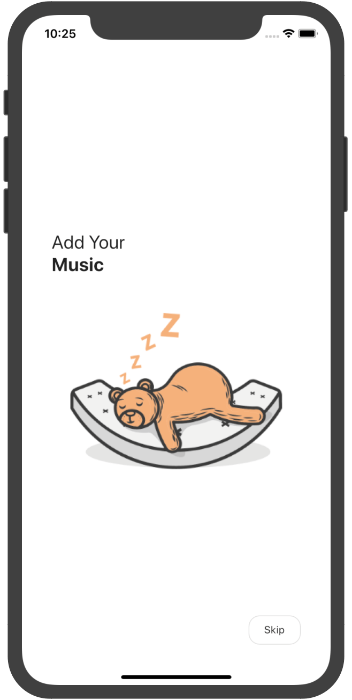
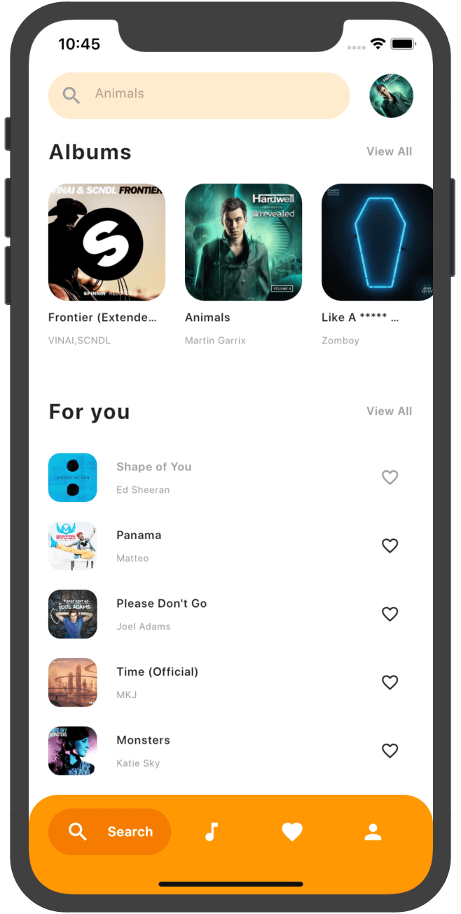
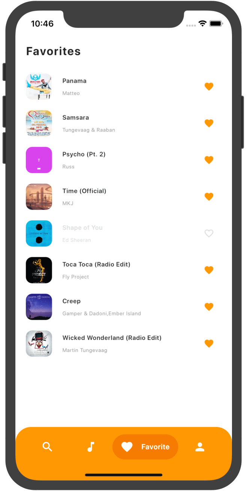
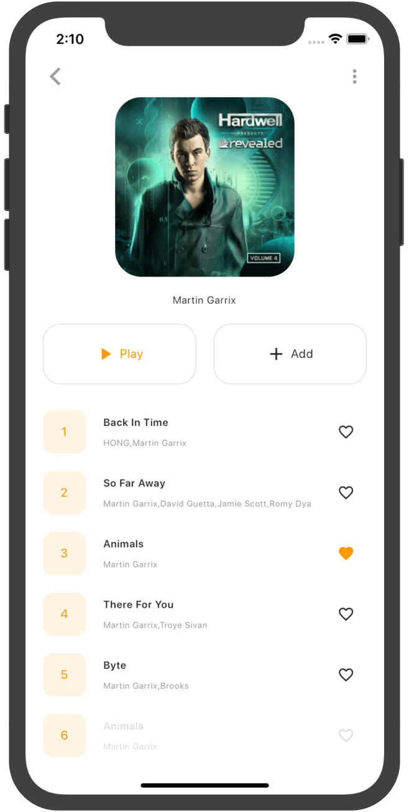
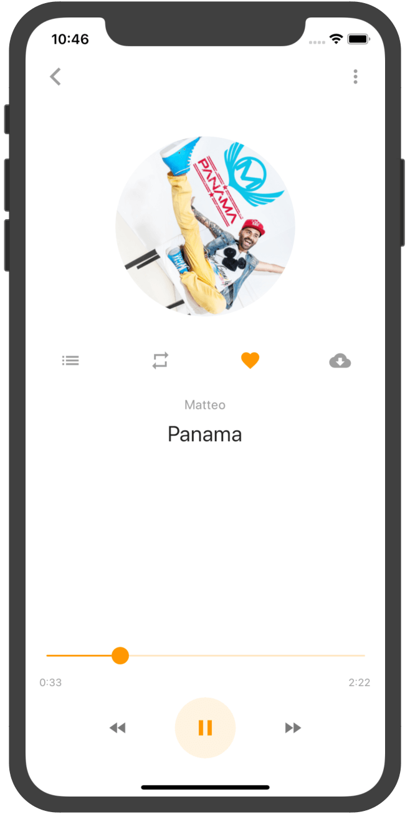
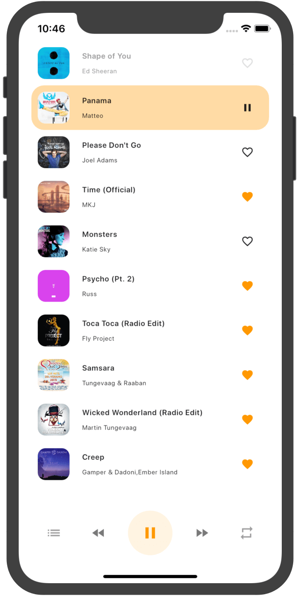
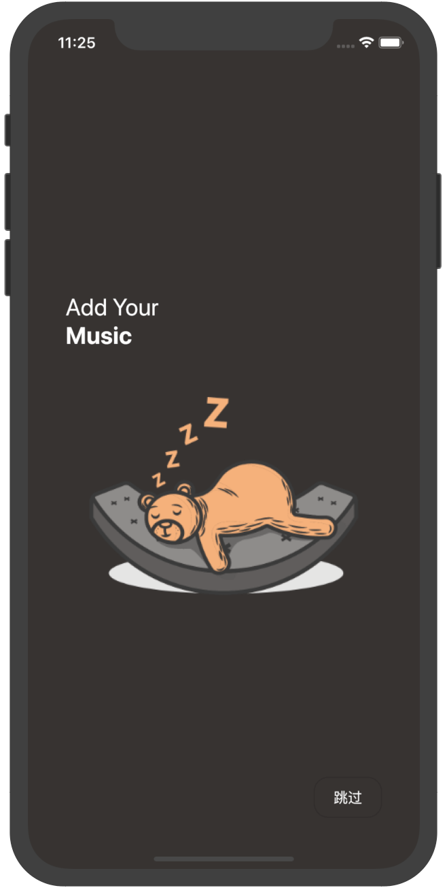
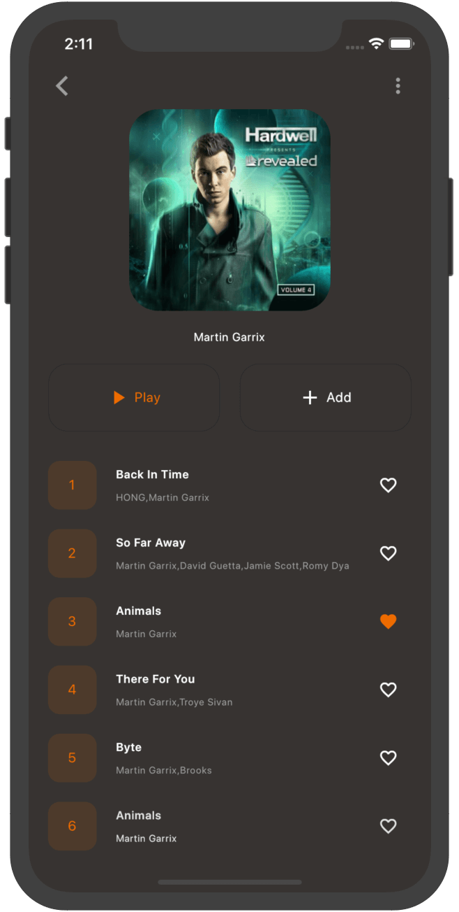
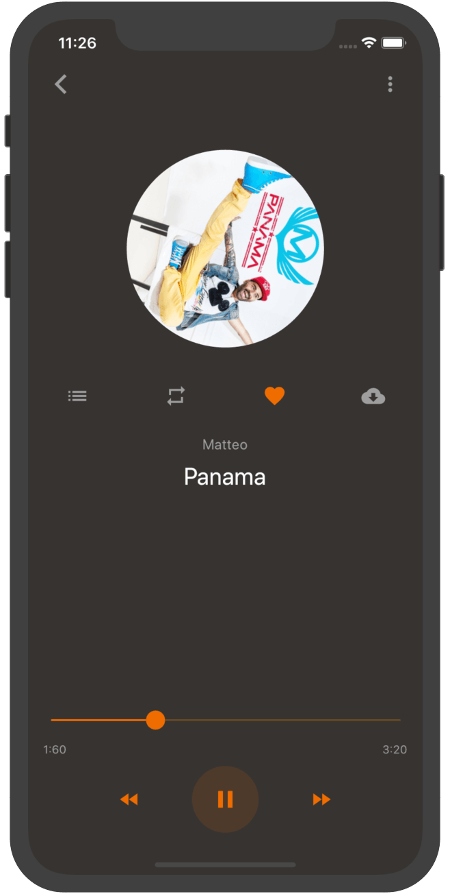
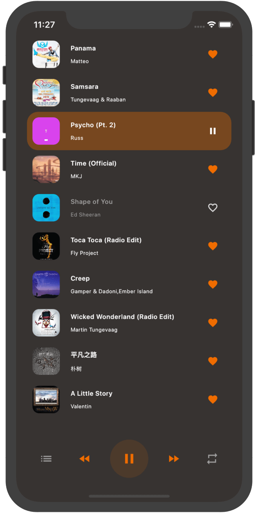

# MelodyFlow

Flutter-based dribbble Design Music Player.

## Features(Android & iOS)

  * [x] search online songs (Require Network Permission)
  * [x] Beautiful UI with multiple themes includes light theme and dark theme
  * [x] multiple language includes chinese and english
  * [x] Play background
  * [x] Animation
  * [x] Full Fledged Example
  * [x] Play / Stop / Pause
  * [x] Previous / Next
  * [x] Seek
  * [x] Shuffle
  * [x] Album Art
  * [x] onComplete
  * [x] onDuration / onCurrentPosition
  * [x] Favorite
  * [x] Download

## Screenshots

- #### Light theme

|  |  |  |
| -------------------------------------------- | ---------------------------------- | ---------------------------------- |
|            |  |  |

- #### Dark theme

|  |  |
| ---------------------------------- | ---------------------------------- |
|  |  |

### Add this to ios Info.plist allow https and background

```yaml
    <key>UIBackgroundModes</key>
    <array>
        <string>audio</string>
    </array>
    <key>NSAppTransportSecurity</key>
    <dict>
    <key>NSAllowsArbitraryLoads</key>
    <true/>
    </dict>
```
